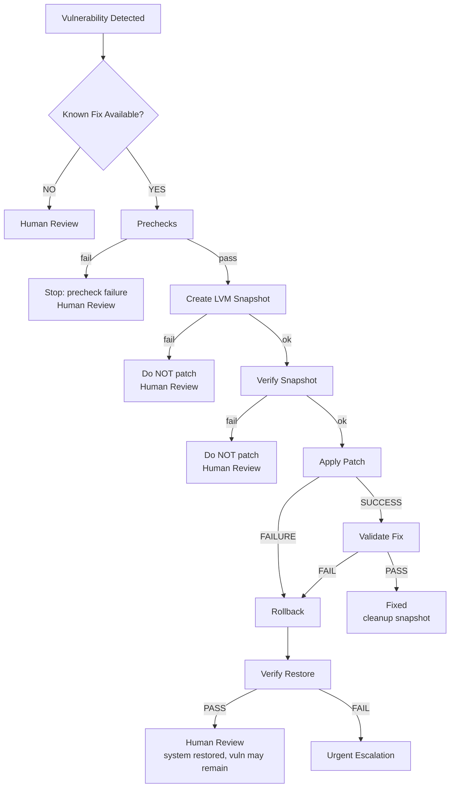
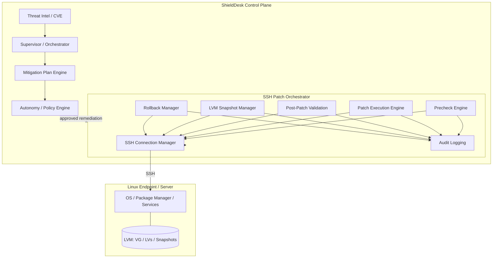
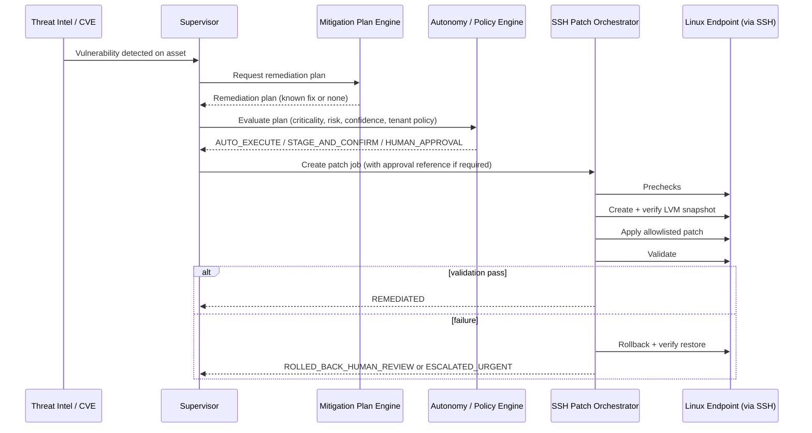
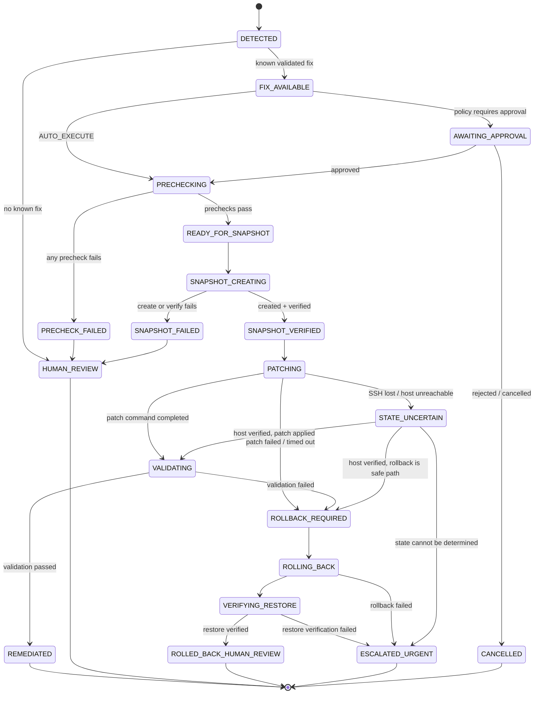

# ShieldDesk — SSH Patch Orchestrator & LVM Rollback

> Implementation documentation / engineering guide for the SSH Patch Orchestrator module of the ShieldDesk cybersecurity platform.

## Implementation Status

| Item | Status |
|---|---|
| **Overall** | **Design Complete / Implementation Starting** |
| Code written | None. Everything below is **planned** unless explicitly marked otherwise |
| Current target | MVP (see [MVP Scope](#19-mvp-scope)) |
| Future integration | Go endpoint agent, Tiered Execution, full policy/approval wiring (see [Integration Roadmap](#4-architecture)) |

> **Reading convention.** Sections marked **MVP** describe what the first implementation builds. Sections marked **FUTURE** describe integration points that are intentionally *not* built in the MVP. Nothing in this document should be read as "already implemented."

## Table of Contents

1. [Core Objective](#1-core-objective)
2. [Separation of Concerns](#2-separation-of-concerns)
3. [LVM Rollback Principle](#3-lvm-rollback-principle)
4. [Architecture](#4-architecture)
5. [Component Breakdown](#5-component-breakdown)
6. [State Machine](#6-state-machine)
7. [Safety Rules](#7-safety-rules)
8. [Approval / Autonomy](#8-approval--autonomy)
9. [Audit Logging](#9-audit-logging)
10. [Security](#10-security)
11. [API / Interface Design](#11-api--interface-design)
12. [Data Models](#12-data-models)
13. [Implementation Phases](#13-implementation-phases)
14. [Recommended Project Structure](#14-recommended-project-structure)
15. [Testing Strategy](#15-testing-strategy)
16. [Important Failure Scenarios](#16-important-failure-scenarios)
17. [Observability](#17-observability)
18. [Security / Operational Principles](#18-security--operational-principles)
19. [MVP Scope](#19-mvp-scope)
20. [Definition of Done](#20-definition-of-done)
21. [Related ShieldDesk Components](#21-related-shielddesk-components)
22. [Next Step](#22-next-step)

---

## 1. Core Objective

The **SSH Patch Orchestrator** safely applies a **known remediation** to a Linux server over SSH, protected by an **LVM snapshot** that serves as a verified recovery point, and then **validates** that the remediation actually worked.

It does three things, in this order, and refuses to proceed if any step cannot be verified:

1. **Prepare**: prechecks and a verified recovery point.
2. **Execute**: apply an allowlisted remediation.
3. **Verify**: validate the fix; if the patch or validation fails, recover and escalate.

### 1.1 Primary workflow



### 1.2 Stage-by-stage explanation

| # | Stage | What happens | Why it exists | On failure |
|---|---|---|---|---|
| 1 | **Vulnerability Detected** | An upstream ShieldDesk component reports a vulnerability on an asset. | Trigger. *Not* performed by this module. | n/a |
| 2 | **Known Fix Available?** | Check whether a **validated/documented remediation** exists for this vulnerability on this asset's OS/package manager. | We only automate fixes someone has vetted. | **NO →** Human Review. |
| 3 | **Prechecks** | Verify SSH, OS, package manager, privileges, disk space, LVM, logical volumes, snapshot feasibility, package and service state. | Catch "this cannot succeed or cannot be undone" *before* touching anything. | Stop. No snapshot, no patch. |
| 4 | **Create LVM Snapshot** | Create a snapshot of each logical volume the patch can modify. | Establish a recovery point. | Do not patch. Human Review. |
| 5 | **Verify Snapshot** | Confirm the snapshot exists, is active/valid, maps to the right origin, and has adequate copy-on-write space. | A snapshot that was "created" but is invalid is not a recovery point. | Do not patch. Human Review. |
| 6 | **Apply Patch** | Execute the allowlisted remediation via the package-manager adapter. | The actual change. | Rollback. |
| 7 | **Validate Fix** | Check package version, expected target version, service health, system health, relevant config, and vulnerability status where possible. | Command success is not proof of remediation. | Rollback. |
| 8 | **Fixed** | Validation passed. Mark remediated, clean up snapshot. | Success path. | n/a |
| 9 | **Rollback** | Restore the system to the pre-patch snapshot state. | Recovery from a failed or harmful patch. | If rollback fails → Urgent Escalation. |
| 10 | **Verify Restore** | Confirm the system actually returned to its pre-patch state. | Rollback "completing" is not proof of restoration. | **FAIL →** Urgent Escalation. |
| 11 | **Human Review** | Rollback verified. System is restored; **the original vulnerability may still exist.** | The case is unresolved and a person must decide next steps. | n/a |
| 12 | **Urgent Escalation** | Rollback or restore verification failed. System state may be unsafe. | Highest-severity outcome. | n/a |

---

## 2. Separation of Concerns

The orchestrator is one link in a chain. It must **not** absorb the responsibilities of its neighbours.

| Concern | Description | Owner |
|---|---|---|
| **A. Vulnerability Detection** | Finding and identifying the vulnerability. | ShieldDesk detection / Threat Intel / CVE (**outside** this module) |
| **B. Remediation Planning** | Deciding what fix applies and how risky it is. | Mitigation Plan Engine (**outside** this module) |
| **C. SSH Patch Execution** | Safely running the approved, allowlisted remediation over SSH. | **This module** |
| **D. LVM Snapshot / Recovery** | Creating, verifying, retaining and restoring snapshots. | **This module** |
| **E. Post-Patch Validation** | Proving the fix worked. | **This module** |
| **F. Rollback** | Reverting a failed patch. | **This module** |
| **G. Human Review / Escalation** | Deciding what to do when automation cannot safely continue. | Humans, surfaced by ShieldDesk; this module *raises* the case |

**Rules that follow from this:**

- The orchestrator is **not** a vulnerability detection engine.
- A **known fix** means a **validated/documented remediation** exists. It does *not* mean "a command string was generated."
- **An AI-generated shell command is not automatically safe to execute.** The orchestrator accepts structured, allowlisted remediation operations, never raw command text (see [Patch Execution Engine](#patch-execution-engine) and [Security](#10-security)).
- The orchestrator does not decide on its own that a patch is safe to run unattended. That is the policy layer's job (see [Approval / Autonomy](#8-approval--autonomy)).

---

## 3. LVM Rollback Principle

> **LVM rollback is a RECOVERY mechanism, not a vulnerability-remediation mechanism.**

Rollback returns the system to how it was. It does not fix anything.

### 3.1 Worked example

```text
Before patch:
    OpenSSL vulnerable

Create snapshot                      → recovery point exists

Apply patch:
    OpenSSL updated

Patch causes system failure

Rollback:
    Restore snapshot

Result:
    System restored to pre-patch state
    Original vulnerability may still exist
```

### 3.2 Reporting rule

```text
Patch failed
+ Rollback successful
= System restored, but vulnerability remains.
```

The system **must** report this accurately and send the case for **human review**. A successful rollback is *never* reported as "remediated," "resolved," or "success" for the vulnerability.

### 3.3 Outcome reporting matrix

| Patch | Validation | Rollback | Reported outcome | Vulnerability status |
|---|---|---|---|---|
| Success | Pass | n/a | `REMEDIATED` | Fixed (as confirmed by validation) |
| Success | Fail | Success + verified | `ROLLED_BACK_HUMAN_REVIEW` | **Still present** |
| Failure | n/a | Success + verified | `ROLLED_BACK_HUMAN_REVIEW` | **Still present** |
| Failure / validation fail | n/a | Failure | `ESCALATED_URGENT` | Unknown; system state uncertain |
| Failure / validation fail | n/a | Success but verification fails | `ESCALATED_URGENT` | Unknown; system state uncertain |
| Not attempted (snapshot failed) | n/a | n/a | `SNAPSHOT_FAILED_HUMAN_REVIEW` | **Still present**, system untouched |

### 3.4 LVM behaviours developers must design for

These are properties of LVM itself that shape the implementation. Treat them as design constraints, not optional edge cases.

| Behaviour | Implication |
|---|---|
| **Snapshots are copy-on-write.** A classic (non-thin) snapshot has a fixed-size COW area. | If it fills up it becomes **invalid** and cannot be used for rollback. Size it deliberately, verify it before patching, and monitor usage while patching. |
| **Merging a snapshot into an in-use origin (e.g. the root volume) is deferred.** | Rollback of a mounted/in-use volume typically completes only after the origin is deactivated and reactivated, usually a **reboot**. The orchestrator must expect to lose its SSH session and must verify state after the host returns. |
| **Rolling back reverts everything on that volume** since the snapshot, not just the patch. | Data written after the snapshot (logs, application data, DB files) on a rolled-back volume is **lost**. Document this and ensure the precheck identifies which volumes are in the rollback set. |
| **`/boot` (and the EFI partition) are often not on LVM.** | A kernel/bootloader update can change state that an LVM snapshot does **not** cover. Precheck must detect this and the remediation plan must declare whether it touches `/boot`. If the patch touches non-LVM state, treat as unsupported for automated patching unless an explicit, tested mitigation exists. |
| **Not every Linux system uses LVM** (plain partitions, btrfs, ZFS, cloud images, containers). | Non-LVM is a **controlled failure** (see below). Never fake or skip the recovery point. |
| **Thin vs. thick LVM** have different snapshot semantics and commands. | MVP supports a defined subset (see [MVP Scope](#19-mvp-scope)); anything else is "unsupported configuration" → Human Review. |
| **Multiple logical volumes** may be involved (`/`, `/usr`, `/var`). | Snapshot every volume the patch may modify, or declare the configuration unsupported. A partial snapshot set is not a full recovery point. |

### 3.5 Non-LVM and unsupported configurations

The orchestrator does **not** assume LVM. If the target has no usable LVM layout, or has a layout the orchestrator does not support, the job ends in a **controlled failure** state (`PRECHECK_FAILED` with reason `NO_LVM` or `UNSUPPORTED_LVM_CONFIG`) and goes to **human review**.

A different recovery mechanism (e.g. VM/hypervisor snapshot, btrfs snapshot) may be added **later** only as an *explicitly supported alternative* with its own design, tests and safety rules. It is **never** silently substituted, and it is out of MVP scope.

---

## 4. Architecture

### 4.1 Component diagram



The component hierarchy, in text form:

```text
ShieldDesk Control Plane
    |
    ├── Supervisor / Orchestrator
    ├── Threat Intel / CVE
    ├── Mitigation Plan Engine
    ├── Autonomy / Policy Engine
    └── SSH Patch Orchestrator
            |
            ├── SSH Connection Manager
            ├── Precheck Engine
            ├── Patch Execution Engine
            ├── Post-Patch Validation
            ├── LVM Snapshot Manager
            ├── Rollback Manager
            └── Audit Logging
                    |
                    ↓
             Linux Endpoint / Server
                    |
                    └── LVM
```

### 4.2 Request flow



### 4.3 Boundaries (what this module is *not*)

- It is **not** responsible for **all** endpoint execution. It covers one execution path: SSH-based patching of Linux servers with LVM recovery.
- It does **not** detect vulnerabilities, generate remediation plans, or own the autonomy policy. It *consumes* the results of those components.
- It does **not** replace the ShieldDesk Go endpoint agent or the Tiered Execution architecture.

### 4.4 FUTURE: integration with the Go endpoint agent and Tiered Execution

> **Status: FUTURE. Not part of the MVP.** The details below are intended direction; confirm against the actual agent and Tiered Execution design before implementing.

| Topic | Intended direction |
|---|---|
| **Relationship to the Go endpoint agent** | The SSH orchestrator covers hosts *without* (or before) an installed agent, or hosts where an agentless path is required. Hosts running the agent are expected to execute remediation through the agent's execution path, not SSH. |
| **Relationship to Tiered Execution** | The orchestrator is *one* executor beneath the existing tiered model. Tiering and approval decisions stay in the existing policy/tier layer; the orchestrator does not define or override tiers. |
| **Shared building blocks** | The `snapshot`, `validation`, `rollback` and `audit` logic is written transport-agnostic where practical (it depends on a "run this controlled operation on the host and return output + exit code" interface). This allows the same safety logic to be reused if/when an agent-based transport is added. |
| **Signed commands / audit** | Privileged execution and audit integrity must align with ShieldDesk's existing signed-command and audit architecture (see [Audit Logging](#9-audit-logging)). |
| **Tier 3 break-glass** | Out of scope. The orchestrator must not implement break-glass behaviour. |

The transport abstraction exists to keep a clean seam; **do not over-build it in the MVP.** One SSH transport behind a small interface is enough.

---

## 5. Component Breakdown

### SSH Connection Manager

Single choke point for all communication with the target. No other component opens its own SSH connection.

**Responsibilities**
- **Secure SSH connection**: modern key exchange/ciphers only; no fallback to weak algorithms.
- **Host verification**: strict host key checking against a pinned/known host key (see [Security](#10-security)). Unknown or changed host key → hard failure, never auto-accept.
- **Authentication**: key-based authentication; credentials supplied by reference (never embedded).
- **Connection timeout**: separate timeouts for connect, per-command, and overall job.
- **Session handling**: explicit open/close, no leaked sessions; a session is scoped to a job.
- **stdout/stderr capture**: captured separately, size-bounded, redacted before storage.
- **Exit code capture**: always recorded; "no exit code" (disconnect/timeout) is a distinct result, *not* treated as failure-or-success.
- **Connection failure handling**: classified errors (`DNS`, `REFUSED`, `TIMEOUT`, `AUTH_FAILED`, `HOST_KEY_MISMATCH`, `DISCONNECTED_MID_COMMAND`).

**Key rule:** a dropped connection mid-command leaves the host in an **uncertain state**. The manager reports it as such; it never silently retries a non-idempotent operation.

Suggested result type (conceptual):

```json
{
  "command_ref": "op:pkg.upgrade:openssl",
  "exit_code": 0,
  "stdout": "…redacted, bounded…",
  "stderr": "",
  "duration_ms": 8421,
  "outcome": "COMPLETED",
  "truncated": false
}
```

`outcome` ∈ `COMPLETED | TIMEOUT | DISCONNECTED | AUTH_FAILED | HOST_KEY_MISMATCH | CONNECT_FAILED`.

---

### Precheck Engine

Determines, **before any change**, whether the job can be executed *and recovered*.

| Check | What it verifies | Failure result |
|---|---|---|
| SSH connectivity | Authenticated session with verified host key | `PRECHECK_FAILED: SSH_UNREACHABLE` |
| Linux OS | `/etc/os-release` identifies a supported Linux distribution/version | `UNSUPPORTED_OS` |
| Package manager | One of the supported managers is present and usable | `UNSUPPORTED_PACKAGE_MANAGER` |
| Required privileges | Account can perform the required privileged operations (as defined by least-privilege config) | `INSUFFICIENT_PRIVILEGES` |
| Disk space | Sufficient free space for package download/install | `INSUFFICIENT_DISK_SPACE` |
| LVM availability | LVM tooling present; relevant volumes are LVM-backed | `NO_LVM` |
| Logical volume identification | Which LVs the patch can modify (e.g. `/`, `/usr`, `/var`), mapped to VG/LV | `UNSUPPORTED_LVM_CONFIG` |
| Snapshot feasibility | Free extents in the VG for COW space; no conflicting snapshots; supported LV type | `INSUFFICIENT_LVM_SPACE` / `UNSUPPORTED_LVM_CONFIG` |
| Non-LVM state touched by patch | Whether the remediation affects `/boot`/EFI or other non-snapshotted state | `UNSUPPORTED_LVM_CONFIG` (non-covered state) |
| Current package state | Installed version, held/pinned packages, package manager not locked/mid-transaction | `PACKAGE_STATE_UNSAFE` |
| Relevant service state | Baseline health of services the patch affects (recorded for later comparison) | `SERVICE_BASELINE_UNHEALTHY` (policy decides if blocking) |

> ### NO VERIFIED RECOVERY POINT → NO AUTOMATED PATCH

Precheck results (including the **baseline** captured for validation, e.g. pre-patch package version and service states) are persisted with the job.

---

### LVM Snapshot Manager

**Responsibilities**
- **Discover required logical volumes** from precheck output.
- **Verify snapshot feasibility** (free VG space, supported LV type).
- **Create snapshot** with a deterministic, collision-safe name derived from the job ID.
- **Verify snapshot** (see below).
- **Track snapshot identity**: VG, LV, snapshot name, UUID, origin, size, creation time, bound to the job ID.
- **Retain snapshot during remediation**; it must not be cleaned up until the job reaches a terminal state that permits it.
- **Rollback when required** (invoked via the Rollback Manager).
- **Verify restoration.**
- **Cleanup snapshot after successful remediation.** Cleanup occurs only after validation passes, and cleanup failure is logged and surfaced (an orphaned snapshot keeps consuming COW space and can degrade performance).

**Snapshot verification checklist**
- Snapshot LV exists and is the one this job created (name + UUID match).
- Snapshot's origin is the expected LV.
- Snapshot is active and **not invalid**.
- COW usage is well below capacity (threshold configurable).
- Every volume in the rollback set has a verified snapshot (a partial set is a failure).

**Monitoring during patch:** snapshot COW usage is sampled while patching; if it approaches capacity, the job treats it as a risk signal (and the recovery point may become invalid; this must be surfaced, not hidden).

**Non-LVM / unsupported:** controlled failure → Human Review (see [§3.5](#35-non-lvm-and-unsupported-configurations)). No silent bypass.

---

### Patch Execution Engine

Patch execution uses **controlled, allowlisted remediation operations**. It must **avoid unrestricted arbitrary shell execution.**

**Design**
- The engine accepts a **structured remediation operation** (type + validated parameters), *not* a free-form command string.
- Operations are drawn from a **registry of allowlisted operation types** (e.g. "upgrade package X to at least version Y", "restart service Z"). Each type maps to a fixed command template with strictly validated parameters (package names/versions matched against a safe pattern; no shell metacharacter pass-through).
- Commands are executed as **argument vectors**, not by interpolating strings into a shell.
- Unknown operation types are rejected (fail closed).
- AI-generated or free-text suggestions can *inform* a human or a reviewed remediation plan, but are **never executed directly.**

**Package-manager abstraction (extensible, not one monolith)**

```go
// Conceptual interface, not final code
type PackageManager interface {
    Name() string
    Detect(ctx context.Context, r Runner) (bool, error)
    InstalledVersion(ctx context.Context, r Runner, pkg string) (string, error)
    Upgrade(ctx context.Context, r Runner, op UpgradeOp) (Result, error)
    IsLocked(ctx context.Context, r Runner) (bool, error)
}
```

| Adapter | Package manager | MVP |
|---|---|---|
| `apt` | Debian / Ubuntu | Choose at least one to implement first |
| `dnf` / `yum` | RHEL family | Add after first adapter is proven |
| `zypper` | SUSE family | Interface supports it; implement later |

The MVP implements **one** adapter fully and tests it on a real VM; the interface exists so others slot in without touching the orchestrator core.

---

### Post-Patch Validation

Validation must verify **more than the command's exit status.**

| Validation | Detail |
|---|---|
| **Package version** | Installed version is read back from the host after patching. |
| **Expected target version** | Installed version meets or exceeds the remediation plan's target (compared with the distribution's version semantics, not string comparison). |
| **Service health** | Services affected by the patch are running and healthy (compared to baseline). |
| **System health** | Basic host sanity (e.g. host responsive, no failed critical units, package manager not left in a broken state). |
| **Relevant configuration** | Config files/settings the remediation depends on are as expected. |
| **Vulnerability remediation status** | Where possible, confirm the vulnerability is actually resolved (e.g. patched version contains the fix per vendor advisory, or a re-check by the detection component). If this cannot be determined, validation reports **"fix applied, remediation not independently confirmed"**, not "fixed". |

> ### PATCH COMMAND SUCCESS ≠ VULNERABILITY FIXED

Backported distribution fixes mean a version number alone may not prove remediation; the remediation plan should carry the *correct* success criterion for the distribution (e.g. a vendor package release containing the fix).

**Validation result values:** `PASSED | FAILED | INCONCLUSIVE`. `INCONCLUSIVE` is **not** treated as `PASSED`; policy determines whether it triggers rollback or human review (default: human review, system left in patched state only if health checks pass and policy allows, otherwise rollback).

---

### Rollback Manager

**When rollback is triggered**
- Patch operation failed or timed out.
- Validation `FAILED`.
- Service/system health regression after patch.
- Manual rollback request by an authorized user (`POST /patch/jobs/{id}/rollback`).
- Recovery from an uncertain state (after verifying the host and determining rollback is the safe path).

**How the correct snapshot is selected**
- Only the snapshot(s) **bound to this job's ID** in the persisted job record are eligible. Selection is **never** by "newest snapshot on the host" or by name guessing.
- Before use, re-verify identity (name + UUID + origin match the recorded snapshot) and validity.
- If the recorded snapshot is missing or invalid → rollback cannot proceed → **Urgent Escalation**.

**How rollback is performed (conceptual)**
1. Mark job `ROLLBACK_REQUIRED`, record reason, emit audit event.
2. Stop/quiesce affected services where required.
3. Merge each snapshot back into its origin (`lvconvert --merge`).
4. If the origin is in use (e.g. root volume), the merge is **deferred**; trigger a controlled reboot so the merge completes. The SSH session is expected to drop.
5. Wait for the host to return (bounded timeout), reconnect with host key verification, then verify.

> The exact commands and reboot handling are **implementation detail for Phase 7**. This README fixes the *contract*: rollback is deterministic, bound to the job's recorded snapshot, and always followed by verification.

**How restoration is verified**
- Snapshot merge completed (snapshot LV no longer present / merge no longer pending).
- Package version equals the **recorded pre-patch baseline**.
- Affected services are in their baseline state.
- Host is reachable with the verified host key and passes basic health checks.

**What happens if rollback fails**

> ### URGENT HUMAN ESCALATION

Rollback failure or restore-verification failure is **never hidden, retried indefinitely, or downgraded.** The job moves to `ESCALATED_URGENT`, emits `ESCALATION_REQUIRED`, and preserves all evidence (logs, snapshot state, `lvs` output) for the responder.

---

## 6. State Machine

### 6.1 Why a state machine

Loosely chained commands (`snapshot && patch && validate || rollback`) fail badly in the cases that matter: partial failures, disconnects, reboots, retries, and duplicate requests. An explicit state machine gives us:

- **Explicit, persisted state**: after a crash or SSH drop we know exactly where the job was.
- **Legal-transition enforcement**: e.g. `PATCHING` is *unreachable* unless `SNAPSHOT_VERIFIED` was reached. "No verified recovery point → no patch" becomes structural, not a convention.
- **Idempotent resume/recovery** for uncertain states.
- **A natural audit trail**: every transition is an audit event.
- **Testability**: each transition and failure path can be tested in isolation.
- **Honest terminal outcomes**: "rolled back, vulnerability remains" is a distinct state, not an error code.

### 6.2 Happy path and recovery path



The simplified, linear form of the main path:

```text
DETECTED
   ↓
FIX_AVAILABLE
   ↓
PRECHECKING
   ↓
READY_FOR_SNAPSHOT
   ↓
SNAPSHOT_CREATING
   ↓
SNAPSHOT_VERIFIED
   ↓
PATCHING
   ↓
VALIDATING
   ├── SUCCESS → REMEDIATED
   └── FAILURE → ROLLBACK_REQUIRED
                         ↓
                    ROLLING_BACK
                         ↓
                    VERIFYING_RESTORE
                     /            \
                SUCCESS          FAILURE
                   ↓                ↓
            HUMAN REVIEW      URGENT ESCALATION
```

### 6.3 State reference

| State | Meaning | Terminal? |
|---|---|---|
| `DETECTED` | Vulnerability reported for an asset. | No |
| `FIX_AVAILABLE` | A validated/documented remediation exists. | No |
| `AWAITING_APPROVAL` | Policy requires human approval/confirmation before execution. | No |
| `PRECHECKING` | Prechecks running. | No |
| `READY_FOR_SNAPSHOT` | Prechecks passed; baseline recorded. | No |
| `SNAPSHOT_CREATING` | Snapshot(s) being created. | No |
| `SNAPSHOT_VERIFIED` | Verified recovery point exists. **Only state from which patching may begin.** | No |
| `PATCHING` | Allowlisted remediation executing. | No |
| `VALIDATING` | Post-patch validation running. | No |
| `REMEDIATED` | Validation passed. Snapshot cleanup follows. | **Yes** (success) |
| `ROLLBACK_REQUIRED` | Rollback decided; reason recorded. | No |
| `ROLLING_BACK` | Snapshot merge in progress (may include reboot). | No |
| `VERIFYING_RESTORE` | Checking the system matches the pre-patch baseline. | No |
| `ROLLED_BACK_HUMAN_REVIEW` | System restored and verified; **vulnerability may remain.** | **Yes** |
| `STATE_UNCERTAIN` | Connection lost / host unavailable during a change. Do not retry blindly. | No |
| `PRECHECK_FAILED` | Precheck failed; nothing was changed. | Leads to `HUMAN_REVIEW` |
| `SNAPSHOT_FAILED` | Snapshot create/verify failed; **no patch applied.** | Leads to `HUMAN_REVIEW` |
| `HUMAN_REVIEW` | Automation stopped; a person decides. | **Yes** |
| `ESCALATED_URGENT` | Rollback/restore failed or state undeterminable. | **Yes** |
| `CANCELLED` | Rejected or cancelled before patching began. | **Yes** |

**Transition rules**
- Transitions are validated by the orchestrator core; illegal transitions are rejected and audited.
- Every transition is persisted **before** the corresponding action begins, and emits an audit event.
- `PATCHING` may only be entered from `SNAPSHOT_VERIFIED`.
- A cancel request after `PATCHING` begins does not abort mid-patch silently; it is handled as a controlled rollback decision (see [API](#11-api--interface-design)).

---

## 7. Safety Rules

These are **non-negotiable** and each must have at least one automated test.

| # | Rule | Enforcement |
|---|---|---|
| 1 | **Never patch without a verified recovery point** when rollback is required. | State machine: `PATCHING` only reachable from `SNAPSHOT_VERIFIED`. |
| 2 | **Never treat patch command success as proof of remediation.** | `PATCHING` → `VALIDATING`, never directly to `REMEDIATED`. |
| 3 | **Never automatically execute unrestricted AI-generated shell commands.** | Patch engine accepts only allowlisted structured operations. |
| 4 | **Never hide rollback failures.** | Rollback failure → `ESCALATED_URGENT` + audit + notification. |
| 5 | **Never report a vulnerability as fixed unless validation confirms it.** | `REMEDIATED` requires `validation.result == PASSED`. |
| 6 | **Snapshot creation failure must stop the automated patch.** | `SNAPSHOT_FAILED` has no edge to `PATCHING`. |
| 7 | **Unsupported LVM configuration must not be silently bypassed.** | Precheck fails closed with explicit reason. |
| 8 | **High-risk actions require the appropriate approval** according to ShieldDesk policy. | Job cannot leave `AWAITING_APPROVAL` without a valid approval reference. |
| 9 | **Every execution step must be auditable.** | Audit event on every transition and every remote operation. |
| 10 | **Human escalation must be explicit** when automation cannot safely continue. | Dedicated terminal states + `HUMAN_REVIEW_REQUIRED` / `ESCALATION_REQUIRED` events. |

---

## 8. Approval / Autonomy

The orchestrator **executes**; it does not decide that a patch is safe to run unattended. That decision belongs to ShieldDesk's **Autonomy / Policy Engine**.

### 8.1 Policy outcomes

| Outcome | Meaning for this module |
|---|---|
| `AUTO_EXECUTE` | Job may proceed through all stages without human action. |
| `STAGE_AND_CONFIRM` | Job proceeds through prechecks and (optionally) staging, then waits for human confirmation before `PATCHING`. |
| `HUMAN_APPROVAL` | Job waits in `AWAITING_APPROVAL` until an authorized human approves. |

> The exact semantics of each outcome (e.g. precisely where `STAGE_AND_CONFIRM` pauses) must follow ShieldDesk's existing autonomy policy definition. The table above is the orchestrator-side interpretation and should be reconciled with the policy owner before Phase 10.

### 8.2 Inputs the policy layer considers

| Factor | Role |
|---|---|
| Asset criticality | More critical assets bias toward stricter approval. |
| Risk tier | Higher-risk operations require stronger approval. |
| Remediation confidence | Low-confidence remediations are not auto-executed. |
| Tenant policy | Tenant-specific rules constrain autonomy. |
| Operational impact | Service restarts/reboots (including rollback reboot) raise impact. |
| Required approval | Determines which role/token must approve. |

### 8.3 Modularity

- The orchestrator calls a narrow `approval.Evaluator` interface and receives a decision; it does not embed policy logic.
- In the **MVP**, the evaluator may be a simple stub (e.g. config-driven decision or "always require approval"), clearly marked as such. Full policy-engine wiring is Phase 10 and may be partially deferred.
- The orchestrator **re-checks** that a valid approval reference exists before `PATCHING` when the decision required one, even if an upstream component claims approval was granted.
- A `rollback` that reboots the host is itself an operationally impactful action; its approval requirements follow policy (an *automatic* rollback after a failed patch is part of the already-approved job unless policy states otherwise).

---

## 9. Audit Logging

Every important event is recorded as an immutable audit event. Audit is a **first-class requirement**, not a debugging aid.

### 9.1 Event types

| Event | Emitted when |
|---|---|
| `PATCH_REQUESTED` | A patch job is created. |
| `POLICY_EVALUATED` | Policy decision (`AUTO_EXECUTE` / `STAGE_AND_CONFIRM` / `HUMAN_APPROVAL`) received. |
| `PRECHECK_STARTED` | Prechecks begin. |
| `PRECHECK_COMPLETED` | Prechecks finish (pass or fail, with result). |
| `SNAPSHOT_CREATE_STARTED` | Snapshot creation begins. |
| `SNAPSHOT_CREATED` | Snapshot created. |
| `SNAPSHOT_VERIFIED` | Snapshot verification passed. |
| `PATCH_STARTED` | Patch execution begins. |
| `PATCH_COMPLETED` | Patch command finished (with exit code/outcome). |
| `VALIDATION_STARTED` | Validation begins. |
| `VALIDATION_PASSED` | Validation passed. |
| `VALIDATION_FAILED` | Validation failed or inconclusive. |
| `ROLLBACK_STARTED` | Rollback begins (with reason). |
| `ROLLBACK_COMPLETED` | Rollback finished and restoration verified. |
| `ROLLBACK_VERIFICATION_FAILED` | Rollback ran but restoration could not be verified. |
| `HUMAN_REVIEW_REQUIRED` | Automation stopped; a person must review. |
| `ESCALATION_REQUIRED` | Urgent escalation (rollback failed / state undeterminable). |

Failure variants (e.g. `SNAPSHOT_CREATE_FAILED`, `PATCH_FAILED`, `STATE_UNCERTAIN_DETECTED`) are added as needed; the list above is the minimum set.

### 9.2 Audit fields

| Field | Description |
|---|---|
| `event_id` | Unique event ID. |
| `incident_id` | ShieldDesk incident the job belongs to. |
| `asset_id` | Target asset. |
| `timestamp` | UTC, RFC 3339. |
| `actor` | Who/what caused the event (user ID, service identity, or `system`). |
| `action` | Event type / operation. |
| `result` | `SUCCESS`, `FAILURE`, `PENDING`, `UNCERTAIN`. |
| `exit_code` | Remote command exit code, if applicable. |
| `snapshot_id` | Snapshot identity, if applicable. |
| `command_ref` | Reference ID of the allowlisted operation (**not** raw command text with secrets). |
| `approval_ref` | Approval/token reference, where applicable. |
| `error` | Structured error info (code + redacted message). |
| `validation_result` | `PASSED` / `FAILED` / `INCONCLUSIVE`, where applicable. |
| `job_id` | Patch job ID (recommended addition for correlation). |
| `state_from` / `state_to` | State transition, for transition events. |

### 9.3 Alignment with ShieldDesk architecture

Privileged execution and audit integrity **must align with ShieldDesk's existing signed-command and audit architecture.** Concretely, before Phase 9/10:

- Confirm how privileged commands are signed/authorized in ShieldDesk today and make remote operations carry the equivalent reference (`command_ref` / approval token).
- Confirm the audit store's integrity mechanism (e.g. append-only/tamper-evident properties) and write to it rather than inventing a parallel one.
- Where the MVP uses a simpler local audit store, mark it clearly as an **interim** implementation and keep the writer behind an interface so it can be swapped.

---

## 10. Security

> **Never put real credentials, private keys, passwords, API keys, or secrets in this repository** (code, configs, tests, fixtures, docs, or CI logs). Use placeholders and add secret patterns to `.gitignore` / pre-commit scanning.

| Area | Requirements |
|---|---|
| **SSH credentials** | Key-based auth; per-asset (or per-tenant) credentials referenced by ID, resolved at runtime from the configured secret source. No password auth by default. No credentials in logs, errors, or audit records. |
| **Host key verification** | Strict verification against a known/pinned host key. Unknown key → fail (no trust-on-first-use in automated mode). Changed key → hard failure + audit + human review (possible MITM or re-provisioned host). |
| **Secrets handling** | Secrets held in memory only as long as needed; never written to disk by the orchestrator; redacted from captured output before persistence. MVP may read from environment/file-based secret source; enterprise secret-manager integration is out of scope. |
| **Least privilege** | Dedicated remote service account. Privileged operations limited to the specific commands required (e.g. a restrictive sudoers policy for the allowlisted operations only), not blanket root. |
| **Command allowlisting** | Only registered operation types; parameters validated against strict patterns; unknown operations rejected. |
| **Command injection prevention** | No string-built shell commands. Use argument vectors / fixed templates. Validate package names, versions, service names, LV/VG names. Reject metacharacters rather than escaping them. |
| **Timeouts** | Connect, per-command and job-level timeouts. Timeout is a distinct outcome (state uncertain), not silently "failed" or "ok". |
| **Replay protection** | Job creation requires an idempotency key; approval tokens are single-use, bound to job + asset + operation, and time-limited. Duplicate/replayed requests are rejected or return the existing job. |
| **Approval validation** | Verify approval reference/token authenticity, scope (job/asset/operation), expiry and approver authority before `PATCHING`. |
| **Audit integrity** | Audit writes are append-only; align with the ShieldDesk signed-command/audit architecture; failure to write audit for a state transition **blocks** the transition (fail closed). |
| **Sensitive output handling** | Remote stdout/stderr may contain secrets/PII: bound size, redact known patterns, store minimally, restrict access to raw output. |
| **Failure-safe behavior** | Any unexpected error stops automation, preserves state and evidence, and routes to human review/escalation. Never "continue anyway." |

**Authorization for the orchestrator API:** callers are authenticated service identities or users; every endpoint enforces authorization (see [§11](#11-api--interface-design)). Tenant isolation is enforced on every job/asset access.

---

## 11. API / Interface Design

> **Conceptual contract only.** This section documents the intended interface; it is not an implementation and paths/fields may be refined in Phase 10 to match ShieldDesk's API conventions.

**Common**
- Auth: authenticated caller (service identity or user) with tenant scoping. Authorization is role/permission-based (see per-endpoint).
- All mutating requests accept an `Idempotency-Key` header.
- Error shape: `{ "error": { "code": "...", "message": "..." } }`.
- Common errors: `401 Unauthorized`, `403 Forbidden`, `404 Not Found`, `409 Conflict` (illegal state transition / duplicate), `422 Unprocessable` (validation, unsupported operation), `429 Too Many Requests`.

### `POST /patch/jobs`

| | |
|---|---|
| **Purpose** | Create a patch job for an asset from an approved/validated remediation plan. |
| **Request** | `incident_id`, `asset_id`, `remediation_plan_id` (or inline structured plan), `policy_decision` reference. |
| **Response** | `201 Created` + job summary (`job_id`, `state`). |
| **Authn/Authz** | Caller needs permission to request remediation on the asset, within tenant. Typically the Supervisor/Policy layer. |
| **States/Errors** | Initial state `FIX_AVAILABLE` / `AWAITING_APPROVAL` / `PRECHECKING`. `422` if the plan contains non-allowlisted operations or no known fix. `409` on duplicate `Idempotency-Key` with different payload. |

```json
// Request
{
  "incident_id": "inc_123",
  "asset_id": "ast_456",
  "remediation_plan_id": "plan_789",
  "policy_decision": { "outcome": "HUMAN_APPROVAL", "ref": "pol_001" }
}
// Response 201
{ "job_id": "job_abc", "state": "AWAITING_APPROVAL" }
```

### `GET /patch/jobs/{id}`

| | |
|---|---|
| **Purpose** | Full job detail (plan, precheck, snapshot, executions, validation, rollback). |
| **Response** | `200` with `PatchJob` (see [Data Models](#12-data-models)). |
| **Authn/Authz** | Read permission on the asset/incident; tenant-scoped. Raw command output requires elevated permission. |
| **Errors** | `404`, `403`. |

### `GET /patch/jobs/{id}/status`

| | |
|---|---|
| **Purpose** | Lightweight status for polling/UI. |
| **Response** | `200` `{ "job_id", "state", "outcome", "vulnerability_status", "updated_at", "requires_human": true/false }`. |
| **Authn/Authz** | Read permission, tenant-scoped. |
| **Errors** | `404`, `403`. |

```json
{
  "job_id": "job_abc",
  "state": "ROLLED_BACK_HUMAN_REVIEW",
  "outcome": "RESTORED_VULNERABILITY_REMAINS",
  "vulnerability_status": "PRESENT",
  "requires_human": true,
  "updated_at": "2025-01-01T12:00:00Z"
}
```

### `POST /patch/jobs/{id}/approve`

| | |
|---|---|
| **Purpose** | Provide human approval/confirmation for a job in `AWAITING_APPROVAL`. |
| **Request** | `approval_ref` / token, optional comment. |
| **Response** | `202 Accepted`, job moves to `PRECHECKING` (or next state). |
| **Authn/Authz** | Approver must hold the role required by the policy decision for this asset/risk tier; approval must be bound to this job (single-use, unexpired). The requester should not self-approve if policy forbids. |
| **Errors** | `409` if job not awaiting approval; `403` insufficient authority; `422` invalid/expired/replayed token. |

### `POST /patch/jobs/{id}/cancel`

| | |
|---|---|
| **Purpose** | Cancel a job. |
| **Request** | `reason`. |
| **Response** | `202` (accepted) with resulting state. |
| **Behaviour** | Before `PATCHING`: moves to `CANCELLED`, snapshot (if any) cleaned up. During/after `PATCHING`: **does not** abruptly kill the operation; becomes a controlled decision (finish → validate, or rollback per policy). After a terminal state: `409`. |
| **Authn/Authz** | Requester or authorized operator, tenant-scoped. |

### `POST /patch/jobs/{id}/rollback`

| | |
|---|---|
| **Purpose** | Manually trigger rollback to the job's recorded snapshot. |
| **Request** | `reason`, `approval_ref` where policy requires. |
| **Response** | `202`, state `ROLLBACK_REQUIRED` → `ROLLING_BACK`. |
| **Authn/Authz** | Elevated permission; rollback can revert data written after the snapshot and may reboot the host, so it is a high-impact action. |
| **Errors** | `409` if no valid recorded snapshot or job in a state where rollback is not allowed; `403`. |

### `GET /patch/jobs/{id}/audit`

| | |
|---|---|
| **Purpose** | Ordered audit trail for the job. |
| **Response** | `200` list of `AuditEvent`, paginated. |
| **Authn/Authz** | Audit-read permission, tenant-scoped. Read-only; no mutation endpoints for audit. |
| **Errors** | `404`, `403`. |

---

## 12. Data Models

Conceptual models with illustrative values. Field names may be refined during implementation.

### PatchJob
```json
{
  "job_id": "job_abc",
  "incident_id": "inc_123",
  "asset_id": "ast_456",
  "remediation_plan_id": "plan_789",
  "state": "PATCHING",
  "outcome": null,
  "vulnerability_status": "PRESENT",
  "policy_decision": { "outcome": "AUTO_EXECUTE", "ref": "pol_001" },
  "approval_ref": null,
  "idempotency_key": "idem_xyz",
  "created_at": "2025-01-01T12:00:00Z",
  "updated_at": "2025-01-01T12:05:00Z"
}
```

### TargetAsset
```json
{
  "asset_id": "ast_456",
  "tenant_id": "tnt_001",
  "hostname": "app-server-01",
  "address": "10.0.0.15",
  "ssh": { "port": 22, "user": "shielddesk-patch", "credential_ref": "cred_ref_001", "host_key_fingerprint": "SHA256:placeholder" },
  "criticality": "HIGH"
}
```

### RemediationPlan
```json
{
  "plan_id": "plan_789",
  "vulnerability_id": "CVE-0000-0000",
  "confidence": "HIGH",
  "operations": [
    {
      "type": "pkg.upgrade",
      "package": "openssl",
      "target_version": "placeholder-version",
      "restart_services": ["nginx"]
    }
  ],
  "touches_non_lvm_state": false,
  "success_criteria": { "min_package_version": "placeholder-version" }
}
```

### PrecheckResult
```json
{
  "job_id": "job_abc",
  "passed": true,
  "checks": [
    { "name": "ssh_connectivity", "result": "PASS" },
    { "name": "os_supported", "result": "PASS", "detail": "ubuntu 22.04" },
    { "name": "lvm_available", "result": "PASS" },
    { "name": "vg_free_space", "result": "PASS", "detail": "free_extents=…" }
  ],
  "baseline": {
    "package_versions": { "openssl": "old-version" },
    "services": { "nginx": "active" }
  },
  "rollback_set": [ { "vg": "vg0", "lv": "root", "mount": "/" } ]
}
```

### Snapshot
```json
{
  "snapshot_id": "snap_001",
  "job_id": "job_abc",
  "vg": "vg0",
  "origin_lv": "root",
  "snapshot_lv": "sd_job_abc_root",
  "lv_uuid": "placeholder-uuid",
  "size": "10G",
  "created_at": "2025-01-01T12:01:00Z",
  "verified": true,
  "cow_usage_percent": 2.1,
  "status": "ACTIVE"
}
```

### PatchExecution
```json
{
  "execution_id": "exe_001",
  "job_id": "job_abc",
  "operation_ref": "op:pkg.upgrade:openssl",
  "started_at": "2025-01-01T12:02:00Z",
  "duration_ms": 8421,
  "exit_code": 0,
  "outcome": "COMPLETED",
  "stdout_ref": "blob_ref_redacted",
  "stderr_ref": null
}
```

### ValidationResult
```json
{
  "job_id": "job_abc",
  "result": "PASSED",
  "checks": [
    { "name": "package_version", "result": "PASS", "expected": ">= placeholder-version", "actual": "placeholder-version" },
    { "name": "service_health", "result": "PASS", "detail": "nginx active" },
    { "name": "vuln_status", "result": "PASS", "detail": "fix confirmed by criteria" }
  ],
  "vulnerability_status": "FIXED"
}
```

### RollbackExecution
```json
{
  "rollback_id": "rb_001",
  "job_id": "job_abc",
  "reason": "VALIDATION_FAILED",
  "snapshot_id": "snap_001",
  "started_at": "2025-01-01T12:08:00Z",
  "merge_deferred": true,
  "reboot_performed": true,
  "restore_verified": true,
  "verification": [
    { "name": "snapshot_merged", "result": "PASS" },
    { "name": "package_version_matches_baseline", "result": "PASS" },
    { "name": "services_match_baseline", "result": "PASS" }
  ],
  "outcome": "RESTORED_VULNERABILITY_REMAINS"
}
```

### AuditEvent
```json
{
  "event_id": "evt_001",
  "incident_id": "inc_123",
  "job_id": "job_abc",
  "asset_id": "ast_456",
  "timestamp": "2025-01-01T12:01:30Z",
  "actor": "system",
  "action": "SNAPSHOT_VERIFIED",
  "result": "SUCCESS",
  "exit_code": 0,
  "snapshot_id": "snap_001",
  "command_ref": "op:lvm.snapshot.verify",
  "approval_ref": null,
  "error": null,
  "validation_result": null
}
```

---

## 13. Implementation Phases

Phases are sequential; each phase's **exit criteria** must be met before starting the next. Keep each phase small and test it against a real Linux VM with LVM as early as Phase 3.

### Phase 1: Basic SSH connectivity and command execution
- **Objective:** Securely connect to a Linux host and run controlled commands with full result capture.
- **Tasks:** SSH Connection Manager; strict host key verification; key auth; timeouts; capture stdout/stderr/exit code; error classification; secret-source abstraction; redaction helper.
- **Expected output:** A tested `ssh` package; a CLI/test harness that runs a harmless read-only command on a VM.
- **Exit criteria:** Connects with verified host key; auth failure, host-key mismatch, timeout and disconnect each produce distinct, tested outcomes; no secrets in logs.

### Phase 2: Linux discovery and prechecks
- **Objective:** Understand the host and decide if the job is eligible.
- **Tasks:** OS detection; package manager detection; privilege check; disk space; package state/locks; service state; baseline capture; `PrecheckResult` model.
- **Expected output:** Precheck Engine producing a structured result with explicit failure reasons.
- **Exit criteria:** Correct pass/fail on supported/unsupported OS and package manager, low disk space, insufficient privileges; baseline persisted.

### Phase 3: LVM discovery and snapshot creation
- **Objective:** Identify the rollback set and create snapshots.
- **Tasks:** Detect LVM; map mounts → LVs/VGs; detect unsupported layouts (non-LVM, `/boot`-only-state, thin if unsupported); compute and check required free space; create snapshots with deterministic names; record snapshot identity.
- **Expected output:** Snapshot Manager that creates a snapshot set for a job.
- **Exit criteria:** Snapshots created on a real LVM VM; no-LVM and insufficient-space cases fail closed with explicit reasons.

### Phase 4: Snapshot verification
- **Objective:** Prove the snapshot is a usable recovery point.
- **Tasks:** Verify existence, name/UUID, origin, active/not-invalid, COW headroom, full coverage of rollback set; COW monitoring helper.
- **Expected output:** `SNAPSHOT_VERIFIED` gate.
- **Exit criteria:** Invalid/missing/partial snapshots are detected and block patching; state machine forbids `PATCHING` without verification.

### Phase 5: Controlled patch execution
- **Objective:** Apply a remediation without arbitrary shell execution.
- **Tasks:** Operation registry/allowlist; parameter validation; first package-manager adapter; argument-vector execution; timeout handling; idempotency considerations; uncertain-state detection on disconnect.
- **Expected output:** Patch Execution Engine for one package manager.
- **Exit criteria:** Allowlisted upgrade succeeds on a VM; non-allowlisted or malformed operations rejected; injection attempts fail; disconnect yields `STATE_UNCERTAIN`.

### Phase 6: Post-patch validation
- **Objective:** Prove the fix, not just command success.
- **Tasks:** Version read-back and comparison; service health vs baseline; system health; config checks; vulnerability-status criteria; `PASSED/FAILED/INCONCLUSIVE`.
- **Expected output:** Validation Engine and `ValidationResult`.
- **Exit criteria:** Exit-code-0-but-wrong-version is detected as failure; service regressions detected; `INCONCLUSIVE` never reported as fixed.

### Phase 7: Rollback implementation
- **Objective:** Restore the pre-patch state from the job's snapshot.
- **Tasks:** Trigger logic; snapshot selection by job binding; quiesce services; merge; deferred-merge/reboot handling; wait-and-reconnect with host key verification.
- **Expected output:** Rollback Manager performing a real rollback.
- **Exit criteria:** On a real VM, a deliberately broken patch is rolled back; wrong/missing snapshot never used.

### Phase 8: Rollback verification
- **Objective:** Prove restoration.
- **Tasks:** Confirm merge completion; compare package versions and services to baseline; host health; failure → `ESCALATED_URGENT`.
- **Expected output:** `VERIFYING_RESTORE` logic and honest outcome reporting ("restored, vulnerability remains").
- **Exit criteria:** Verified restore → `ROLLED_BACK_HUMAN_REVIEW`; simulated verification failure → `ESCALATED_URGENT`.

### Phase 9: Audit logging
- **Objective:** Make every step auditable.
- **Tasks:** Audit writer interface; events from [§9.1](#91-event-types); fields from [§9.2](#92-audit-fields); transition-linked emission; fail-closed on audit write failure; structured logging; redaction.
- **Expected output:** Complete audit trail for any job.
- **Exit criteria:** Every transition and remote operation has an event; trail reconstructs the whole job; alignment with ShieldDesk audit architecture confirmed (or interim status documented).

### Phase 10: ShieldDesk integration / policy / approval workflow
- **Objective:** Connect to the rest of ShieldDesk.
- **Tasks:** Implement API contract; Supervisor integration; policy evaluator integration (`AUTO_EXECUTE` / `STAGE_AND_CONFIRM` / `HUMAN_APPROVAL`); approval token validation; idempotency/replay protection; status/audit surfaces for the UI.
- **Expected output:** Jobs created and approved through ShieldDesk flows.
- **Exit criteria:** Unapproved jobs cannot patch; replayed/forged approvals rejected; tenant isolation verified.

### Phase 11: Failure and security testing
- **Objective:** Prove behaviour under adverse conditions.
- **Tasks:** Execute the full [test matrix](#153-test-matrix); fault injection (disconnects, reboots, full COW); security review (injection, host key, secrets, authz).
- **Expected output:** Test report; fixes for discovered issues.
- **Exit criteria:** All Definition-of-Done items satisfied; all safety rules covered by passing tests on a real Linux VM.

---

## 14. Recommended Project Structure

Go is recommended for the orchestrator, consistent with the ShieldDesk Go endpoint agent. **Confirm this against the actual ShieldDesk control-plane language/stack before creating the module**; if the control plane uses a different stack, adjust accordingly.

```text
ssh-patch-orchestrator/
├── cmd/
├── internal/
│   ├── orchestrator/
│   ├── ssh/
│   ├── precheck/
│   ├── patch/
│   ├── snapshot/
│   ├── rollback/
│   ├── validation/
│   ├── approval/
│   ├── audit/
│   └── security/
├── api/
├── configs/
├── tests/
├── docs/
├── go.mod
└── README.md
```

| Path | Responsibility |
|---|---|
| `cmd/` | Entry points (service binary, and a small dev/test CLI harness). No business logic. |
| `internal/orchestrator/` | Job lifecycle and the **state machine**: transition validation, persistence, sequencing of stages, uncertain-state handling. The only place that decides "what happens next." |
| `internal/ssh/` | SSH Connection Manager: connections, host key verification, auth, timeouts, result capture. Exposes a small `Runner` interface used by everything else. |
| `internal/precheck/` | Precheck Engine: OS/package-manager/privilege/disk/LVM/service checks and baseline capture. |
| `internal/patch/` | Patch Execution Engine: operation registry/allowlist, parameter validation, package-manager adapters (`apt`, `dnf/yum`, `zypper`). |
| `internal/snapshot/` | LVM Snapshot Manager: discovery, feasibility, create, verify, track, cleanup, COW monitoring. |
| `internal/rollback/` | Rollback Manager: trigger handling, snapshot selection, merge, reboot/reconnect, restore verification. |
| `internal/validation/` | Post-Patch Validation: version, service, system, config, vulnerability-status checks. |
| `internal/approval/` | Policy/approval integration: evaluator interface, approval token validation, idempotency/replay guards. (MVP: stub behind interface.) |
| `internal/audit/` | Audit writer interface and implementation, event/field definitions, redaction. |
| `internal/security/` | Cross-cutting security helpers: input validators, secret-source abstraction, redaction, allowlist primitives. |
| `api/` | API contract (e.g. OpenAPI spec) and handlers. Contract-first; thin handlers. |
| `configs/` | Example configuration (**placeholders only, no secrets**), allowlist definitions, thresholds. |
| `tests/` | Integration/fault-injection tests and VM test harness (unit tests live beside code). |
| `docs/` | Supplementary docs: runbooks (human review / urgent escalation), VM test setup, ADRs. |

**Don't over-engineer the MVP.** Start with only the packages needed for the current phase; keep interfaces small (`Runner`, `PackageManager`, `AuditWriter`, `ApprovalEvaluator`, job store) and resist adding abstraction until a second implementation is needed.

---

## 15. Testing Strategy

### 15.1 Test levels

| Level | Scope |
|---|---|
| **Unit tests** | State machine transitions (legal/illegal), input validators, allowlist, version comparison, output redaction, snapshot/rollback decision logic, audit event construction. SSH and remote commands are mocked behind the `Runner` interface. |
| **Integration tests** | Real SSH against disposable Linux VMs with LVM (and variants without LVM), exercising prechecks → snapshot → patch → validate → rollback end to end. |
| **Fault-injection tests** | Kill SSH mid-patch, reboot the VM, drop the network, fill the snapshot COW, make the package manager fail/hang. |
| **Security tests** | Injection attempts, unauthorized/replayed requests, host key tampering, secrets-in-logs scanning. |

Test environments must be **disposable VMs** with snapshots at the hypervisor level so tests can be reset, and **never** production hosts.

### 15.2 Scenarios

- SSH failure
- Authentication failure
- Host verification failure
- Unsupported OS
- Unsupported package manager
- Insufficient disk space
- No LVM
- Insufficient LVM space
- Snapshot creation failure
- Snapshot verification failure
- Patch failure
- Patch timeout
- Service failure
- Validation failure
- Rollback success
- Rollback failure
- SSH disconnect during patch
- Server reboot
- Network interruption
- Duplicate/replayed execution request
- Unauthorized execution
- Command injection attempts

### 15.3 Test matrix

| # | Scenario | Setup / injection | Expected final state | Patch applied? | Must verify |
|---|---|---|---|---|---|
| 1 | SSH unreachable | Host down / port closed | `PRECHECK_FAILED` → `HUMAN_REVIEW` | No | Distinct error class; audit event |
| 2 | Authentication failure | Wrong/revoked key | `PRECHECK_FAILED` → `HUMAN_REVIEW` | No | No credential leakage; no retry storm |
| 3 | Host verification failure | Changed host key | `PRECHECK_FAILED` → `HUMAN_REVIEW` | No | Connection refused; never auto-accepted; audited |
| 4 | Unsupported OS | Non-Linux / unsupported distro | `PRECHECK_FAILED` → `HUMAN_REVIEW` | No | Reason `UNSUPPORTED_OS` |
| 5 | Unsupported package manager | No supported manager | `PRECHECK_FAILED` → `HUMAN_REVIEW` | No | Reason `UNSUPPORTED_PACKAGE_MANAGER` |
| 6 | Insufficient disk space | Fill filesystem | `PRECHECK_FAILED` → `HUMAN_REVIEW` | No | Threshold logic correct |
| 7 | No LVM | Plain-partition VM | `PRECHECK_FAILED` → `HUMAN_REVIEW` | No | Not silently bypassed |
| 8 | Insufficient LVM space | VG with no free extents | `PRECHECK_FAILED` → `HUMAN_REVIEW` | No | Reason `INSUFFICIENT_LVM_SPACE` |
| 9 | Snapshot creation failure | Force `lvcreate` failure | `SNAPSHOT_FAILED` → `HUMAN_REVIEW` | **No** | No path to `PATCHING` |
| 10 | Snapshot verification failure | Invalid/partial/mismatched snapshot | `SNAPSHOT_FAILED` → `HUMAN_REVIEW` | **No** | Partial set rejected |
| 11 | Patch failure | Package manager returns error | `ROLLED_BACK_HUMAN_REVIEW` | Failed | Rollback runs; vuln reported as present |
| 12 | Patch timeout | Hanging package operation | Uncertain → verified → rollback/escalate | Unknown | No blind retry; state verified first |
| 13 | Service failure | Patch breaks a service | `ROLLED_BACK_HUMAN_REVIEW` | Yes (reverted) | Service state == baseline after restore |
| 14 | Validation failure | Exit 0 but wrong version | `ROLLED_BACK_HUMAN_REVIEW` | Yes (reverted) | Never `REMEDIATED` |
| 15 | Rollback success | Failed patch + healthy snapshot | `ROLLED_BACK_HUMAN_REVIEW` | Reverted | "Restored, vulnerability remains" reported |
| 16 | Rollback failure | Corrupt/missing snapshot at rollback | `ESCALATED_URGENT` | Unknown | Not hidden; evidence preserved |
| 17 | Restore verification failure | Restore differs from baseline | `ESCALATED_URGENT` | Unknown | `ROLLBACK_VERIFICATION_FAILED` audited |
| 18 | SSH disconnect during patch | Kill connection mid-command | `STATE_UNCERTAIN` → resolved by verification | Unknown | No blind retry |
| 19 | Server reboot | Reboot during patch and during rollback | Resumes via verification; rollback merge completes | Varies | Reconnect with host key check; correct final state |
| 20 | Network interruption | Drop packets mid-job | `STATE_UNCERTAIN` → verify/escalate | Unknown | Bounded waits; escalate if undeterminable |
| 21 | Duplicate/replayed request | Same idempotency key / reused approval token | Rejected or returns existing job | No second run | Single execution only |
| 22 | Unauthorized execution | Missing/insufficient permission; cross-tenant | `401`/`403` | No | Audited; no job created |
| 23 | Missing/invalid approval | Skip approval when required | Stays `AWAITING_APPROVAL` | No | Cannot reach `PATCHING` |
| 24 | Command injection | Metacharacters in package/service/LV names | `422`, rejected | No | No remote command executed |
| 25 | Snapshot COW exhaustion | Fill COW during patch | Rollback unavailable → handled/escalated | Yes | Invalid snapshot detected, not hidden |
| 26 | Non-allowlisted operation | Free-form command in plan | `422` rejected | No | Fail closed |
| 27 | Secrets in output | Remote output contains secret-like strings | Redacted in stored output/logs | n/a | Secrets scan passes |
| 28 | Audit write failure | Force audit store failure | Transition blocked; fail closed | Not started/Unchanged | No unaudited step |

---

## 16. Important Failure Scenarios

| | Scenario | Expected behavior | Final status |
|---|---|---|---|
| **A** | **No known fix** | Do not attempt automation. Route to human review. | `HUMAN_REVIEW` |
| **B** | **Precheck failure** | Stop. Nothing changed. Report the specific failed check. | `PRECHECK_FAILED` → `HUMAN_REVIEW` |
| **C** | **Snapshot creation failure** | **Do not patch.** Clean up partial snapshots. Human review. | `SNAPSHOT_FAILED` → `HUMAN_REVIEW` |
| **D** | **Snapshot verification failure** | **Do not patch.** Treat the recovery point as non-existent; clean up. Human review. | `SNAPSHOT_FAILED` → `HUMAN_REVIEW` |
| **E** | **Patch failure** | Trigger rollback. | `ROLLBACK_REQUIRED` → … |
| **F** | **Patch succeeds but validation fails** | Trigger rollback. A "successful" patch that fails validation is a failed remediation. | `ROLLBACK_REQUIRED` → … |
| **G** | **Rollback succeeds** | System restored. **Vulnerability may remain.** Report accurately; human review. | `ROLLED_BACK_HUMAN_REVIEW` |
| **H** | **Rollback fails** | Do not hide or retry endlessly. Preserve evidence. **Urgent human escalation.** | `ESCALATED_URGENT` |
| **I** | **SSH connection lost during patch** | Treat as **uncertain state**. **Do not blindly retry.** Reconnect (host key verified), determine actual host state (package state, package manager lock/transaction, services, snapshot status), then decide: validate, roll back, or escalate. | `STATE_UNCERTAIN` → resolved or `ESCALATED_URGENT` |
| **J** | **Server becomes unavailable** | Wait within a bounded window; if the state cannot be safely determined, **escalate to a human.** Never assume success or failure. | `ESCALATED_URGENT` |

**Notes**
- In E/F, rollback is part of the already-initiated job; the **final reported state** is determined by rollback verification (G or H), never by the original patch result.
- In I, *"don't retry"* applies to non-idempotent remote operations. Read-only verification is always safe to retry.
- A rollback that depends on a reboot (deferred merge) expects the connection to drop; that is **not** scenario I as long as it is the orchestrator's own planned reboot and the host returns and verifies.

---

## 17. Observability

### 17.1 What is recorded

| Signal | Detail |
|---|---|
| **Structured logs** | JSON logs with `job_id`, `incident_id`, `asset_id`, `state`, `event`, `duration_ms`, `error_code`; secrets redacted. |
| **Job status** | Current `state`, `outcome`, `vulnerability_status`, `requires_human`. |
| **Execution duration** | Per stage and total (precheck, snapshot, patch, validation, rollback). |
| **Patch result** | Operation outcome, exit code, target vs. installed version. |
| **Snapshot status** | Created / verified / COW usage / retained / cleaned up / orphaned. |
| **Rollback status** | Triggered? reason, merge status, reboot, restore verification result. |
| **Validation result** | Per-check results and overall `PASSED/FAILED/INCONCLUSIVE`. |
| **Error reason** | Stable error codes (e.g. `NO_LVM`, `SNAPSHOT_VERIFY_FAILED`) plus redacted detail. |
| **Audit trail** | Full ordered event history ([§9](#9-audit-logging)). |

Suggested metrics (names illustrative): job counts by terminal state, stage durations, snapshot failure rate, rollback rate, escalation count, orphaned-snapshot count. **Alert** on `ESCALATED_URGENT`, orphaned snapshots, and snapshot COW nearing capacity.

### 17.2 Surfacing in the ShieldDesk UI (FUTURE)

> Intended direction; subject to the UI team's design.

| UI element | Source |
|---|---|
| Job timeline / progress | State transitions + `GET /patch/jobs/{id}/audit` |
| Status badge (e.g. *Remediated*, *Restored: vulnerability remains*, *Urgent*) | `GET /patch/jobs/{id}/status` → `outcome`, `vulnerability_status` |
| "Needs human attention" queue | Jobs with `requires_human == true` (`HUMAN_REVIEW`, `ROLLED_BACK_HUMAN_REVIEW`, `ESCALATED_URGENT`) |
| Precheck / validation details | `PrecheckResult`, `ValidationResult` |
| Snapshot and rollback panel | `Snapshot`, `RollbackExecution` |
| Approval actions | `POST /approve`, `/cancel`, `/rollback` with role-based visibility |

The UI must present **"System restored, vulnerability remains"** distinctly from **"Fixed"**; a rolled-back job must never display as a success.

---

## 18. Security / Operational Principles

```text
SAFE BY DEFAULT
FAIL CLOSED
AUDIT EVERYTHING
VERIFY BEFORE EXECUTION
VERIFY AFTER EXECUTION
RECOVER BEFORE ESCALATING
NEVER HIDE FAILURE
HUMAN CONTROL FOR HIGH-RISK ACTIONS
```

| Principle | Meaning here |
|---|---|
| **Safe by default** | Defaults are the restrictive option (require approval, deny unknown operations, strict host keys). |
| **Fail closed** | Ambiguity, missing data, or unsupported config → stop, never proceed. |
| **Audit everything** | No unaudited state transition or remote operation. |
| **Verify before execution** | Prechecks and a verified snapshot precede any change. |
| **Verify after execution** | Validation after patch; verification after rollback. |
| **Recover before escalating** | Attempt the defined recovery (rollback) first, where safe, then escalate with evidence. |
| **Never hide failure** | Failures, including rollback failures and "vulnerability remains," are reported plainly. |
| **Human control for high-risk actions** | High-risk actions need policy-defined approval; humans own unresolved cases. |

---

## 19. MVP Scope

### 19.1 In scope (MVP)

- Linux SSH connection (strict host key verification, key auth)
- Basic host discovery
- Prechecks
- LVM detection
- LVM snapshot creation
- Snapshot verification
- Controlled package patch (allowlisted operations; **one** package-manager adapter first)
- Post-patch validation
- Rollback
- Rollback verification
- Structured logging
- Basic audit trail

### 19.2 Out of scope (MVP)

| Out of scope | Why / when |
|---|---|
| Full autonomous vulnerability discovery | Belongs to detection components, not this module. |
| Complex multi-server orchestration | Single-host jobs first. |
| Arbitrary shell execution | Violates safety rules; not planned. |
| Advanced AI-generated remediation | Remediations must be validated/allowlisted first. |
| Full enterprise secret-management integration | MVP uses a simple secret-source abstraction. |
| Tier 3 break-glass implementation | Separate ShieldDesk concern. |
| Large-scale fleet orchestration | Later, after single-host safety is proven. |
| Non-LVM recovery mechanisms (hypervisor/btrfs/ZFS snapshots) | Only as future, explicitly designed alternatives. |
| Go endpoint agent transport / Tiered Execution integration | FUTURE (see [§4.4](#44-future-integration-with-the-go-endpoint-agent-and-tiered-execution)). |
| Full UI | FUTURE (see [§17.2](#172-surfacing-in-the-shielddesk-ui-future)). |

### 19.3 MVP simplifications (must be explicit)

| Area | MVP simplification | Must still hold |
|---|---|---|
| Policy | Stub evaluator behind interface | Orchestrator re-checks approval before `PATCHING` |
| Audit store | Simple append-only store behind interface | Fail closed on audit write failure |
| LVM | Subset of layouts (e.g. classic LVM snapshots on defined LVs) | Everything else fails closed with explicit reason |
| Package managers | One adapter implemented | Interface supports adding others |

---

## 20. Definition of Done

```text
[ ] SSH connection works securely
[ ] Host identity verified
[ ] Prechecks implemented
[ ] LVM detection works
[ ] Snapshot creation works
[ ] Snapshot verification works
[ ] Patch execution works
[ ] Validation works
[ ] Rollback works
[ ] Rollback verification works
[ ] Failure states handled
[ ] Audit logging implemented
[ ] Security tests pass
[ ] No secrets committed
[ ] Documentation complete
[ ] Tested against real Linux VM
[ ] Human-review paths verified
```

---

## 21. Related ShieldDesk Components

| Component | Relationship to this module |
|---|---|
| **Supervisor / Orchestrator** | Creates patch jobs and consumes outcomes. |
| **Threat Intel / CVE** | Source of vulnerability information. Not part of this module. |
| **Mitigation Plan Engine** | Produces the remediation plan (known fix or none) this module executes. |
| **Autonomy / Policy Engine** | Decides `AUTO_EXECUTE` / `STAGE_AND_CONFIRM` / `HUMAN_APPROVAL`. |
| **Signed-command / audit architecture** | Privileged execution and audit integrity must align with it (§9.3). |
| **Go endpoint agent** | FUTURE: agent-based execution path; this module covers SSH-based patching only. |
| **Tiered Execution architecture** | FUTURE: this module acts as one executor beneath the existing tier model. |
| **ShieldDesk UI** | FUTURE: surfaces job status, audit, and escalations. |

> Several of these integration details depend on ShieldDesk components outside this repository. Where this document describes expected behaviour of those components, **verify against their actual specs** before implementing the integration (Phase 10).

---

## 22. Next Step

**Begin Phase 1: SSH connectivity and Linux host discovery.**
