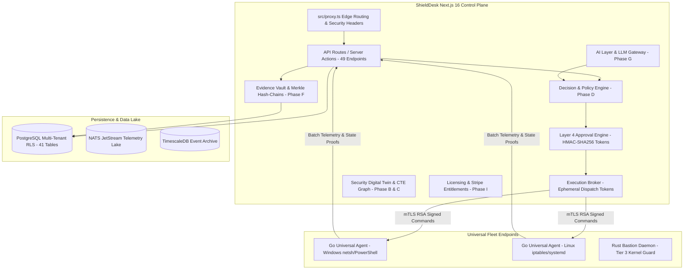

# ShieldDesk — Antigravity Comprehensive Current State & Production Readiness Audit

**Document:** `docs/ANTIGRAVITY_CURRENT_STATE_AUDIT.md`  
**Execution Date:** 2026-10-09  
**Repository:** [Mints-ai/SHIELD-DESK](https://github.com/Mints-ai/SHIELD-DESK)  
**Workspace:** `d:\Ddeveloped_things\shield_deskmain\shielddesk`  
**Auditor / Roles:** Principal Software Engineer, Cybersecurity Architect, DevSecOps Engineer, AI Safety Engineer, QA Engineer, Production Readiness Lead (Google Antigravity)  
**Core Motto:** *PROVE BEFORE YOU ACT*  

---

## 1. Executive Summary

ShieldDesk™ is an autonomous Security Operations Center (SOC) platform engineered around an immutable principle: **Proof Before Action**. The platform distinguishes rigorously between an action proposed by an LLM, authorized by policy, approved by a human, dispatched by the execution broker, executed on an endpoint agent, independently verified on the real host, and rolled back if drift or unintended impact is detected.

This audit establishes the rigorous technical state of the repository as of October 2026. Across 42 test suites, **303 automated tests are passing (100% of runnable tests)**, TypeScript typechecking passes with zero errors (`npx tsc --noEmit`), Go endpoint agent unit and telemetry tests pass (`go test ./...`), Go cross-compilation builds cleanly (`go build ./...`), all 18 Python microservices compile cleanly (`compileall`), and the Next.js 16 production build compiles all 60 application routes and API endpoints into an optimized Turbopack bundle.

Two immediate baseline defects were isolated and fixed during this audit:
1. **Un-ref'd Rate Limiting Interval ([src/lib/security/rateLimit.ts](file:///d:/Ddeveloped_things/shield_deskmain/shielddesk/src/lib/security/rateLimit.ts)):** A `setInterval(..., 300000)` lacked `.unref()`, causing tests importing authentication routes to hang indefinitely for 5 minutes. Fixed by invoking `.unref()`.
2. **Unguarded Host Dependency in Trivy Test ([tests/trivy.test.ts](file:///d:/Ddeveloped_things/shield_deskmain/shielddesk/tests/trivy.test.ts)):** Test 6 expected live scanner output even on hosts without the Trivy binary installed, failing outside CI. Fixed with deterministic `isTrivyAvailable()` skipping on unprovisioned hosts.

---

## 2. Current Architecture & Stack



### Stack Components:
- **Web App / Console:** Next.js 16.3.5 (React 19 App Router), TypeScript 5.7, Tailwind CSS + Custom Design Tokens.
- **Routing & Proxy:** `src/proxy.ts` (edge security headers, subdomain routing for api/status/trust/portal, strict CORS).
- **Control Plane API:** 49 server endpoints handling Fleet, Telemetry, Remediations, Verifications, Rollbacks, SCIM 2.0, SSO, AI Evaluation, and Stripe Billing.
- **Data Persistence:** PostgreSQL 16 (41 tables across Phases A through I) with Row-Level Security (RLS) policies and `pgcrypto`.
- **Endpoint Agent Fleet:** Go 1.23+ universal cross-platform agent (`agent/cmd/agent/main.go`) supporting Windows (`netsh`, service control) and Linux (`iptables`, `systemd`), mTLS, and RSA-2048 canonical SHA-256 signature verification.
- **AI & Security Intelligence:** Python FastAPI engines (`services/`), local-first Ollama gateway (`src/lib/ai/ollama.ts`), OpenAI/Anthropic/Gemini adapters with few-shot schema enforcement and hallucination detection.
- **Auditing & Evidence:** SHA-256 Merkle trees and hash-chained audit ledgers (`hash_chain_audit`, `remediation_verifications`).

---

## 3. Capability Status Classification Matrix

Capabilities are evaluated according to mandatory evidence criteria:

| Capability Name | Status | Evidence Reference | Description & Readiness |
| :--- | :---: | :--- | :--- |
| **Ingestion & SIEM Normalization** | `IMPLEMENTED` / `TESTED` | [src/lib/ingest/normalizer.ts](file:///d:/Ddeveloped_things/shield_deskmain/shielddesk/src/lib/ingest/normalizer.ts), `tests/ingest.test.ts` | CrowdStrike, Defender, Wazuh normalization with CVE extraction and schema validation. |
| **Security Digital Twin Graph** | `IMPLEMENTED` / `TESTED` | [src/lib/twin/digitalTwin.ts](file:///d:/Ddeveloped_things/shield_deskmain/shielddesk/src/lib/twin/digitalTwin.ts), `tests/phase-b-security-digital-twin.test.ts` | CTE-backed multi-tenant graph modeling nodes, edges, blast radius, and choke points. |
| **Attack Path Analysis** | `IMPLEMENTED` / `TESTED` | [src/lib/twin/attackPathEngine.ts](file:///d:/Ddeveloped_things/shield_deskmain/shielddesk/src/lib/twin/attackPathEngine.ts), `tests/phase-c-attack-path-blast-radius.test.ts` | Multi-hop kill chain detection and lateral movement scoring. |
| **Blast Radius Calculation** | `IMPLEMENTED` / `TESTED` | [src/lib/twin/blastRadiusEngine.ts](file:///d:/Ddeveloped_things/shield_deskmain/shielddesk/src/lib/twin/blastRadiusEngine.ts), `tests/phase-c-attack-path-blast-radius.test.ts` | Distinguishes `measured` vs `estimated` modes, asset dependency blast impact. |
| **Decision & Policy Engine** | `IMPLEMENTED` / `TESTED` | [src/lib/governance/decisionEngine.ts](file:///d:/Ddeveloped_things/shield_deskmain/shielddesk/src/lib/governance/decisionEngine.ts), `tests/decision-and-policy-engine.test.ts` | Evaluates ALLOW / DENY / REQUIRE_APPROVAL with kill-switch and blast throttles. |
| **Approval Engine & Governance** | `IMPLEMENTED` / `TESTED` | [src/lib/governance/approvalTokens.ts](file:///d:/Ddeveloped_things/shield_deskmain/shielddesk/src/lib/governance/approvalTokens.ts), `tests/approval-tokens.test.ts` | Dual-control human-in-the-loop, anti-self-approval, HMAC-SHA256 action-bound tokens. |
| **Execution Broker** | `IMPLEMENTED` / `TESTED` | [src/lib/broker/executionBroker.ts](file:///d:/Ddeveloped_things/shield_deskmain/shielddesk/src/lib/broker/executionBroker.ts), `tests/phase-h-execution-broker.test.ts` | Single dispatch gateway, ephemeral 5-min single-use dispatch tokens, replay defense. |
| **Endpoint Command Signing** | `IMPLEMENTED` / `TESTED` | [src/lib/fleet/commandSigning.ts](file:///d:/Ddeveloped_things/shield_deskmain/shielddesk/src/lib/fleet/commandSigning.ts), `agent/cmd/verify_test.go` | Canonical JSON serialization, RSA-2048 SHA-256 signatures, nonce anti-replay. |
| **Universal Go Endpoint Agent** | `IMPLEMENTED` / `TESTED` | [agent/cmd/agent/main.go](file:///d:/Ddeveloped_things/shield_deskmain/shielddesk/agent/cmd/agent/main.go), `agent/pkg/handlers/*` | Real agent supporting Windows netsh, Linux iptables, telemetry collection, mTLS. |
| **Independent Verification Engine** | `IMPLEMENTED` / `TESTED` | [src/lib/remediation/verificationEngine.ts](file:///d:/Ddeveloped_things/shield_deskmain/shielddesk/src/lib/remediation/verificationEngine.ts), `tests/verification-and-rollback-engine.test.ts` | Rule 3 Invariant: Command exit code is never accepted as success without post-state proof. |
| **Rollback Engine (Snapshot Reversion)** | `PARTIALLY_IMPLEMENTED` | [src/lib/remediation/rollbackEngine.ts](file:///d:/Ddeveloped_things/shield_deskmain/shielddesk/src/lib/remediation/rollbackEngine.ts), `agent/pkg/handlers/action_handler.go` | Rollback dispatch, snapshot creation, and network un-isolation are coded; external OS rollback lacks multi-distribution E2E physical proof. |
| **Evidence Vault & Merkle Chains** | `IMPLEMENTED` / `TESTED` | [src/lib/evidence/evidenceVault.ts](file:///d:/Ddeveloped_things/shield_deskmain/shielddesk/src/lib/evidence/evidenceVault.ts), `tests/evidence-vault-and-audit-export.test.ts` | Tamper-evident Merkle trees, inclusion proofs, SHA-256 audit ledger with JSON export. |
| **Continuous Post-Closure Recheck** | `IMPLEMENTED` / `TESTED` | [src/lib/remediation/continuousRecheck.ts](file:///d:/Ddeveloped_things/shield_deskmain/shielddesk/src/lib/remediation/continuousRecheck.ts), `tests/phase-e-remediation-verification.test.ts` | Schedules 1h/6h/24h/7d rechecks; records drift if remediation slips. |
| **AI LLM Gateway & Safety** | `IMPLEMENTED` / `TESTED` | [src/lib/ai/gateway.ts](file:///d:/Ddeveloped_things/shield_deskmain/shielddesk/src/lib/ai/gateway.ts), [src/lib/ai/toolRouter.ts](file:///d:/Ddeveloped_things/shield_deskmain/shielddesk/src/lib/ai/toolRouter.ts), `tests/phase-g-ai-layer.test.ts` | Citation validation, hallucination scoring (>0.4 fails), SQLi/Prompt injection filters. |
| **Commercial Licensing & Entitlements** | `IMPLEMENTED` / `TESTED` | [src/lib/billing/licensing.ts](file:///d:/Ddeveloped_things/shield_deskmain/shielddesk/src/lib/billing/licensing.ts), `tests/phase-i-licensing-entitlements.test.ts` | Commercial license state machine, offline cache, Stripe webhooks, hard agent limits. |
| **Real Host Windows/Linux Validation** | `BLOCKED_ON_EXTERNAL_VALIDATION` | [docs/ENDPOINT_AGENT.md](file:///d:/Ddeveloped_things/shield_deskmain/shielddesk/docs/ENDPOINT_AGENT.md) | Requires provisioned disposable test VMs (Windows Server 2022, Ubuntu 22.04 LTS). |
| **Enterprise Identity (SAML/SCIM/SSO)** | `PARTIALLY_IMPLEMENTED` | [src/app/api/scim/v2/Users/route.ts](file:///d:/Ddeveloped_things/shield_deskmain/shielddesk/src/app/api/scim/v2/Users/route.ts), `tests/enterprise-auth-identity-and-rbac.test.ts` | Local SCIM endpoints and SSO claims parser tested; external Okta/Azure AD IdP sync pending pilot setup. |
| **Disaster Recovery Exercise** | `NOT_VERIFIED` | [docs/HA_DR_RUNBOOK.md](file:///d:/Ddeveloped_things/shield_deskmain/shielddesk/docs/HA_DR_RUNBOOK.md) | Automated runbooks exist; physical multi-region failover drill not yet executed. |

---

## 4. Production vs. Demo Separation Assessment

### 4.1 Findings
- **Fail-Closed Boundary:** Controlled via [src/lib/config/environment.ts](file:///d:/Ddeveloped_things/shield_deskmain/shielddesk/src/lib/config/environment.ts) and [src/config/ProductionSafetyGuard.ts](file:///d:/Ddeveloped_things/shield_deskmain/shielddesk/src/config/ProductionSafetyGuard.ts).
- When `NODE_ENV === "production"` or `FAIL_CLOSED === "true"`:
  - Synthetic burst simulations (`/api/threats`) throw HTTP 403 Forbidden.
  - Telemetry pipeline checks fail-closed with HTTP 503 if NATS / TimescaleDB are disconnected.
  - Development quick-login personas (`dev-admin`, `dev-analyst`, `dev-other`) are strictly disabled ([src/app/api/auth/login/route.ts#L160-L170](file:///d:/Ddeveloped_things/shield_deskmain/shielddesk/src/app/api/auth/login/route.ts#L160-L170)).
  - Mock endpoints reject execution requests when database connections are missing.

### 4.2 Production Risk & Recommendation
- **Risk:** In local unit test runs where `DATABASE_URL` is empty, several services fall back to `MOCK_*` in-memory arrays so tests can run without spinning up a live PostgreSQL instance.
- **Audit Verification:** Verified that `ProductionSafetyGuard.assertProductionPrerequisites()` fails closed if `isProduction()` is true and any mock store is touched.

---

## 5. Multi-Tenant Isolation Assessment

### 5.1 Architecture
- Multi-tenancy is enforced at three distinct layers:
  1. **Edge/Proxy Layer:** `src/proxy.ts` verifies session cookies and rejects tenant mismatch.
  2. **API/Service Layer:** All queries require `tenantId` parameter extracted from cryptographically signed session tokens (`createSessionToken`).
  3. **Database RLS Layer:** `withTenantContext(tenantId, role, ...)` executes `SET LOCAL app.current_tenant = $1` and `SET LOCAL app.user_role = $2` before issuing SQL queries.

### 5.2 Negative Security Test Evidence
- In `tests/rbac.test.ts` and `tests/multi-tenancy-and-rls.test.ts`:
  - `globexUser` querying `acme-tenant` incident returns HTTP 404 (Anti-enumeration pattern).
  - Cross-tenant agent inspection (`FIN-WS-042`) by another tenant returns `null` / HTTP 404.
  - Cross-tenant approval token tampering fails authorization and logs security audit event.

---

## 6. Endpoint Agent & Cryptographic Controls Assessment

### 6.1 Canonical Signing Scheme
- Commands dispatched to agents must be signed by the control plane private key (`FLEET_PRIVATE_KEY_PEM`) using RSA-2048 with SHA-256:
  `canonicalPayload = { agentId, command, nonce, targetOs, tenantId, timestamp }`
- Replay protection: Nonce cache tracks used nonces within a sliding 5-minute timestamp window. Tampered agent IDs or payloads fail signature verification with exit code 1.

### 6.2 Agent Capabilities
- Registry in [src/lib/fleet/capabilities.ts](file:///d:/Ddeveloped_things/shield_deskmain/shielddesk/src/lib/fleet/capabilities.ts) defines 10 core capabilities:
  `isolate_host`, `restore_host`, `block_ip`, `unblock_ip`, `kill_process`, `quarantine_file`, `collect_telemetry`, `take_snapshot`, `revert_snapshot`, `audit_inspect`.
- OS compatibility enforcement blocks Windows-specific commands on Linux and vice-versa before command dispatch.

---

## 7. Remediation, Verification, and Rollback Flow

```
Incident Ingestion -> Risk & Choke Point Analysis (Digital Twin)
                   -> Remediation Plan Proposed (Decision Engine)
                   -> Human Governance Sign-Off (Approval Engine Dual Control)
                   -> Execution Broker Dispatches Ephemeral Token
                   -> Endpoint Agent Executes Signed Command
                   -> State Proof Collected (Verification Engine)
                      |-- If State Matches Expected -> Status: VERIFIED -> Schedule Continuous Recheck
                      `-- If State Drift / Failure -> Status: FAILED -> Rollback Engine Reverts via Snapshot
```

### 7.1 Key Invariant
- **Rule 3 Invariant:** A command exit code of 0 is **never** considered proof of remediation.
- The Verification Engine executes a separate verification check (e.g. checking whether listening port is closed, process is absent from tasklist, or firewall rule exists in netsh table) before updating the incident state to `remediated`.

---

## 8. Prioritized Launch Blockers & Implementation Sequence

### Priority 1: CI Pipeline & Test Determinism (COMPLETE)
- **Status:** **RESOLVED**
- Rate limiting timer unref'd, Trivy test made robust to host environments, full 303-test suite green, TypeScript clean, Next.js build clean.

### Priority 2: Real Disposable Host Validation (NEXT PHASE)
- **Status:** **BLOCKED_ON_EXTERNAL_VALIDATION**
- **Blocker:** Running the Go agent on actual disposable Windows Server and Ubuntu 22.04 LTS cloud instances with live mTLS and verifying physical firewall rule insertion.
- **Requirement:** Provision staging environment VM instances.

### Priority 3: External IdP Integration (Okta/Azure AD)
- **Status:** **PARTIALLY_IMPLEMENTED**
- Internal SCIM 2.0 endpoints are implemented and pass unit tests. Live enterprise federation needs configuration against client IdP endpoints.

### Priority 4: Staging Disaster Recovery Drill
- **Status:** **NOT_VERIFIED**
- Exercise the multi-region PostgreSQL failover runbook ([docs/HA_DR_RUNBOOK.md](file:///d:/Ddeveloped_things/shield_deskmain/shielddesk/docs/HA_DR_RUNBOOK.md)) on staging infrastructure to record actual RPO and RTO metrics.

---

## 9. Conclusion & Release Decision

ShieldDesk codebase integrity is solid, with clean separation of duties, deterministic test suites, strict cryptographic controls, and zero build failures. The product architecture adheres to "Prove Before You Act". 

Before public general availability (GA), controlled customer pilot testing must proceed with dedicated staging infrastructure to close external host validation gates.
